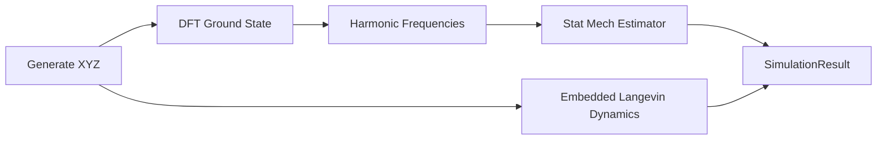

# PyQChem

Orchestrated molecular simulator that connects **XYZ structure generation**, **DFT ground-state energies**, **statistical mechanical property estimation**, and **embedded dynamics** where a molecule evolves in spacetime inside a fixed host framework.

## Features

- **XYZ I/O** — read/write structures with optional `substrate` / `fixed` atom tags
- **Structure builders** — water geometry, SMILES embedding (optional RDKit), silica host tetrahedron
- **DFT (PySCF)** — ground-state energy and harmonic frequencies via configurable functional/basis
- **Statistical mechanics** — RRHO partition functions and thermodynamic properties (U, H, S, G, Cp)
- **Embedded dynamics** — Langevin integration of substrate atoms with a frozen host framework
- **Orchestrator** — single pipeline tying electronic structure, thermodynamics, and spacetime evolution together

## Installation

```bash
cd PyQChem
pip install -e ".[dev]"
```

For SMILES-based structure generation:

```bash
pip install -e ".[dev,smiles]"
```

## Quick start

### Python API

```python
from pyqchem import SimulationOrchestrator, EmbeddedSystem, HostFramework
from pyqchem.orchestrator import SimulationConfig
from pyqchem.xyz import build_water, write_xyz
from pyqchem.structure import build_silica_tetrahedron

water = build_water()
host = build_silica_tetrahedron(center=water.positions[0] + 2.5)
system = EmbeddedSystem(substrate=water, host=host)

write_xyz(system.as_combined_molecule(), "initial.xyz")

config = SimulationConfig(dynamics_steps=20, temperature_k=300.0)
result = SimulationOrchestrator(config).run(system)

print(result.initial_dft.energy_hartree)
print(result.thermodynamics.entropy_j_mol_k)
```

### CLI demo

```bash
pyqchem --temperature 300 --steps 20 --output-dir output
```

### Example script

```bash
python examples/run_water_in_host.py
```

## Architecture



| Module | Role |
|--------|------|
| `pyqchem.xyz` | XYZ read/write, SMILES builder, water template |
| `pyqchem.structure` | Atoms, molecules, host frameworks, embedded systems |
| `pyqchem.dft` | PySCF ground-state DFT and Hessian frequencies |
| `pyqchem.statmech` | RRHO partition functions and thermodynamics |
| `pyqchem.internal_coords` | Wilson B-matrix, stretch/bend/torsion/rotation primitives, Hessian projection |
| `pyqchem.translation` | Cubic-grid rigid translations `(delta_x, delta_y, delta_z)` |
| `pyqchem.sampling` | 1-D energy slices along stretch, bend, torsion, and rotation coordinates |
| `pyqchem.dynamics` | Internal normal-mode Langevin dynamics with fixed host |
| `pyqchem.orchestrator` | End-to-end pipeline coordination |

## Embedded systems

An `EmbeddedSystem` combines:

1. A **substrate molecule** (QM region for DFT, evolving in dynamics)
2. A **fixed host framework** (frozen atoms that provide steric/environmental constraints)

Host atoms are tagged `fixed` in XYZ output and never updated during dynamics. The substrate region evolves in **internal normal-mode coordinates** derived from the DFT Hessian: each mode is classified as a stretch, bend, torsion, or rotation and integrated with its own harmonic frequency from the projected molecular Hessian.

### Internal coordinates

```python
from pyqchem import InternalCoordinateSystem
from pyqchem.xyz import build_water

water = build_water()
ics = InternalCoordinateSystem(water)
analysis = ics.project_hessian(hessian_cart, angstrom_hessian=False)

for kind, modes in ics.modes_by_kind(analysis).items():
    freqs = [m.frequency_cm1 for m in modes]
    print(kind.value, freqs)
```

### 1-D internal coordinate sampling

Stretch, bend, and torsion coordinates use independent 1-D grids. Rotations use ZYZ Euler angles with a Lebedev `(theta, phi)` sphere and equally spaced `chi`. Translations use a cubic grid of `(delta_x, delta_y, delta_z)` displacements.

```python
from pyqchem import InternalModeSampler, SamplingSettings

sampler = InternalModeSampler(water, analysis, reference_energy_hartree=dft.energy_hartree)
result = sampler.sample_all(SamplingSettings(lebedev_points=26, n_chi=36, n_translation=11))
translations = result.translations.samples
```

## Tests

```bash
pytest
```

Slow DFT integration tests are marked `@pytest.mark.slow`.

## License

MIT — Copyright (c) 2026 Lance Bettinson. See [LICENSE](LICENSE).
